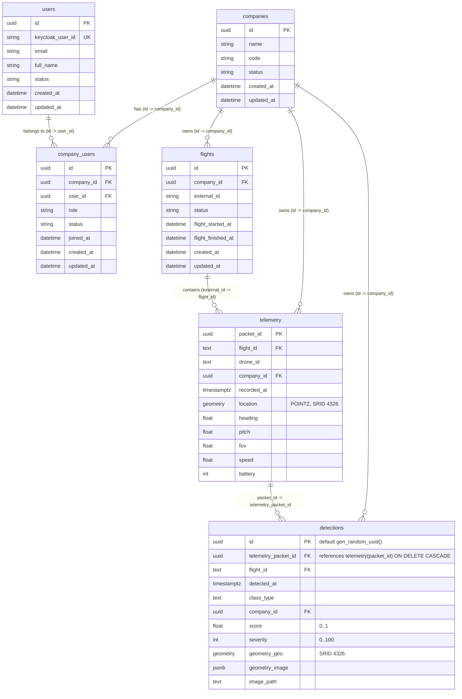

# ForestMap ERD

## Application DB (`forestmap`)

```mermaid
erDiagram
    companies ||--o{ company_users : "has (id -> company_id)"
    users ||--o{ company_users : "belongs to (id -> user_id)"
    companies ||--o{ flights : "owns (id -> company_id)"
    companies ||--o{ telemetry : "owns (id -> company_id)"
    companies ||--o{ detections : "owns (id -> company_id)"
    flights ||--o{ telemetry : "contains (external_id -> flight_id)"
    telemetry ||--o{ detections : "packet_id -> telemetry_packet_id"

    companies {
        uuid        id PK
        string      name
        string      code
        string      status
        datetime    created_at
        datetime    updated_at
    }

    users {
        uuid        id PK
        string      keycloak_user_id UK
        string      email
        string      full_name
        string      status
        datetime    created_at
        datetime    updated_at
    }

    company_users {
        uuid        id PK
        uuid        company_id FK
        uuid        user_id FK
        string      role
        string      status
        datetime    joined_at
        datetime    created_at
        datetime    updated_at
    }

    flights {
        uuid        id PK
        uuid        company_id FK
        string      external_id
        string      status
        datetime    flight_started_at
        datetime    flight_finished_at
        datetime    created_at
        datetime    updated_at
    }

    telemetry {
        uuid        packet_id PK
        text        flight_id FK
        text        drone_id
        uuid        company_id FK
        timestamptz recorded_at
        geometry    location "POINTZ, SRID 4326"
        float       heading
        float       pitch
        float       fov
        float       speed
        int         battery
    }

    detections {
        uuid        id PK "default gen_random_uuid()"
        uuid        telemetry_packet_id FK "references telemetry(packet_id) ON DELETE CASCADE"
        text        flight_id FK
        timestamptz detected_at
        text        class_type
        uuid        company_id FK
        float       score "0..1"
        int         severity "0..100"
        geometry    geometry_geo "SRID 4326"
        jsonb       geometry_image
        text        image_path
    }
```
