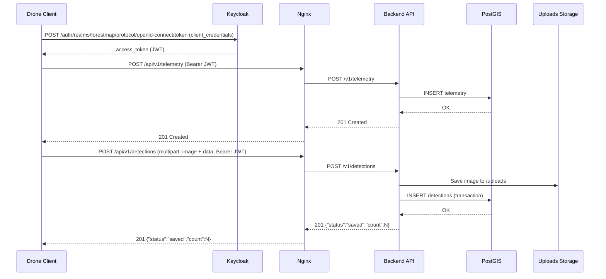
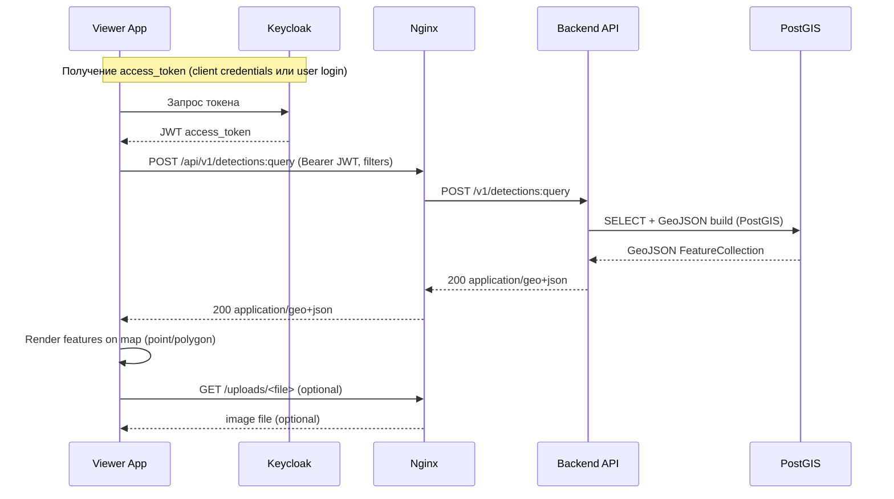
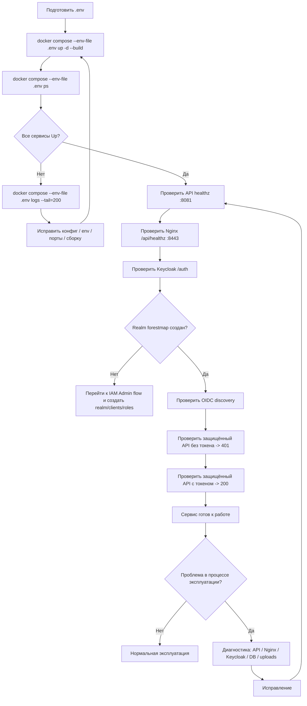

# ForestMap Flows

Документ описывает основные пользовательские и административные сценарии работы с сервисом **ForestMap**.

---

## Содержание

1. [Роли](#роли)
2. [Flow: Drone Client (телеметрия + детекции)](#1-flow-drone-client-телеметрия--детекции)
3. [Flow: Viewer (оператор карты, чтение детекций)](#2-flow-viewer-оператор-карты-чтение-детекций)
4. [Flow: App Admin (развертывание и проверка сервиса)](#3-flow-app-admin-развертывание-и-проверка-сервиса)
5. [Flow: IAM Admin (настройка Keycloak)](#4-flow-iam-admin-настройка-keycloak)

---

## Роли

- **Drone Client** — сервисный клиент (дрон / бортовой агент / интеграция), отправляет телеметрию и детекции
- **Viewer** — оператор (пользователь карты), запрашивает и просматривает детекции
- **App Admin** — администратор сервиса (infra/backend/nginx/db)
- **IAM Admin** — администратор Keycloak (realm, clients, roles, users)

---

## 1. Flow: Drone Client (телеметрия + детекции)

### Цель

Отправить данные полёта в backend:
1) телеметрию  
2) детекции с изображением

### Предусловия

- Развернуты `api`, `db`, `nginx`, `keycloak`
- В Keycloak создан realm `forestmap`
- Создан confidential client (например, `forestmap-drone`)
- Клиенту выданы нужные роли (например, `drone`)

### Результат

- Телеметрия сохранена в `telemetry`
- Детекции сохранены в `detections`
- Изображение сохранено в `/uploads/...`

### Диаграмма (sequence)


## 2. Flow: Viewer (оператор карты, чтение детекций)

### Цель

Получить GeoJSON с детекциями и отобразить их на карте.

### Предусловия (текущий этап)

- API доступен
- Keycloak настроен
- У клиента/пользователя есть токен с ролью на чтение (например, `viewer`)

### Результат

- Получен `GeoJSON FeatureCollection`
- Карта показывает объекты (точки/полигоны)
- При наличии `image_path` можно запросить изображение через `/uploads/...`

### Диаграмма (sequence)


## 3. Flow: Admin (App Admin — развертывание, проверка и диагностика сервиса)

### Цель

Развернуть стек ForestMap, убедиться, что сервис работает, и уметь быстро локализовать проблему при сбое.

### Предусловия

- Есть доступ к серверу (SSH)
- Установлены Docker и Docker Compose
- Подготовлен `.env`
- Порты свободны (или согласованы значения в `.env`)
- В репозитории актуальная версия проекта

### Результат

- Контейнеры запущены (`api`, `db`, `frontend`, `nginx`, `keycloak`, `keycloak-db`)
- API отвечает на `healthz`
- Nginx проксирует `/api/` и `/auth/`
- Keycloak доступен и готов к настройке realm/clients
- Загруженные изображения отдаются через `/uploads/...` (если есть данные)

### Диаграмма (flowchart)


## 4. Flow: IAM Admin (Keycloak Admin — настройка авторизации)

### Цель

Настроить Keycloak для ForestMap:
- создать realm
- создать роли
- создать клиентов (drone / viewer)
- выдать роли service account / пользователям
- проверить токены и доступ к API

### Предусловия

- Keycloak запущен (`keycloak`, `keycloak-db`)
- Nginx проксирует `/auth/`
- Есть bootstrap admin credentials (из `.env`)
- Backend настроен на корректные `OIDC_ISSUER` и `OIDC_JWKS_URL`

### Результат

- Realm `forestmap` создан
- Созданы роли (`drone`, `viewer`, `admin`)
- Создан M2M-клиент `forestmap-drone` (confidential + service accounts)
- (Опционально) создан клиент для frontend/viewer
- Токены содержат нужные claims/roles
- Доступ к API работает согласно ролям

### Диаграмма (flowchart)

```mermaid
flowchart TD
    A[Войти в Keycloak Admin Console] --> B[Создать Realm: forestmap]
    B --> C[Создать роли: drone, viewer, admin]
    C --> D[Создать Client: forestmap-drone]
    D --> E[Включить Client Authentication]
    E --> F[Включить Service Accounts]
    F --> G[Скопировать Client Secret]
    G --> H[Назначить роли service account]
    H --> I[Проверить token по client_credentials]
    I --> J[Проверить доступ к API с токеном]
    J --> K[Готово]

    C --> L[Опционально: создать frontend client]
    L --> M[Настроить Redirect URIs / Web Origins]
    M --> N[Подготовить login flow (Authorization Code + PKCE)]

